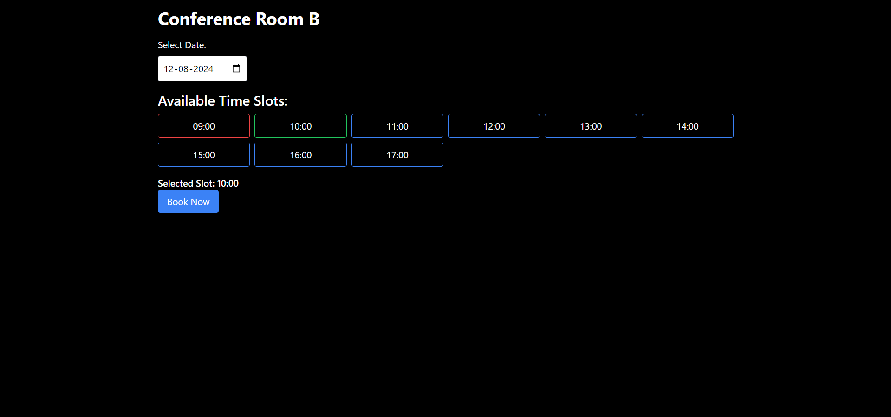
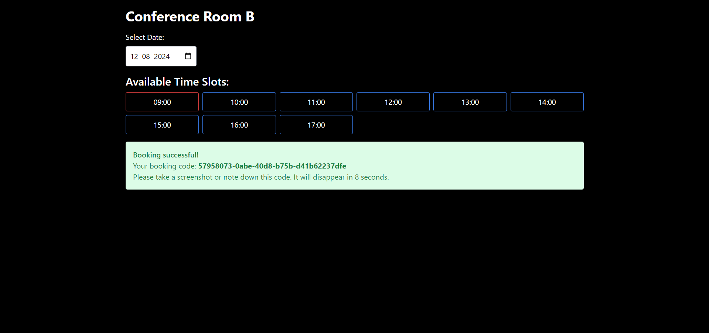

# Room Booking App

This is a simple room booking application built with Flask (backend) and Next.js (frontend). It allows users to view available rooms, their amenities, and make bookings.

## Features

- **View Available Rooms:** Users can see a list of rooms with their names, capacities, and available amenities (projector, sound system).
- **Search Rooms:**  Filter rooms by name to easily find the one you're looking for.
- **Check Availability:** See the available time slots for each room on a given date.
- **Make Bookings:** Book a room for a specific time slot. Bookings are assigned a unique code for access.

## Screenshots

Here's a quick look at the app:

**Available Rooms View:**


**Room Availability View:**


**Booking Process:**



 

## Technologies Used

**Backend:**

- **Flask:** Python web framework for creating the API.
- **Flask-SQLAlchemy:** ORM for interacting with the SQLite database.
- **Flask-CORS:** Enables Cross-Origin Resource Sharing for communication with the frontend.
- **pytz:**  Handles timezone conversions (important for booking accuracy).
- **UUID:** Used for generating unique booking codes.

**Frontend:**

- **Next.js:** React framework for building the user interface.
- **(Add any other frontend libraries you are using here, e.g., for styling, date/time pickers)** 

## Installation

**1. Backend Setup:**

   - **Navigate to the backend directory:**
     ```bash
     cd backend
     ```
   - **Create a virtual environment (recommended):**
     ```bash
     python3 -m venv env 
     source env/bin/activate
     ```
   - **Install dependencies:**
     ```bash
     pip install -r requirements.txt
     ```
     - **Add Room Data Fixtures (Run Once):**
     ```bash
     python add_fixtures.py 
     ```
   - **Run the Flask app:**
     ```bash
     flask run 
     ``` 
     (This will usually start the server at `http://127.0.0.1:5000/`)

**2. Frontend Setup:**

   - **Navigate to the frontend directory:**
     ```bash
     cd frontend 
     ```
   - **Install frontend dependencies:**
     ```bash
     npm install  
     ```
   - **Start the development server:**
     ```bash
     npm run dev
     ```
     (Follow the instructions in your terminal to open the app in your browser)

## API Endpoints

**Rooms:**

- **GET /api/rooms**
   - Get a list of all rooms, including their availability for the current day in the Asia/Kolkata timezone.
   - **Optional Query Parameter:** `q` (search query for room name).
   - **Example Request:** `GET /api/rooms?q=Conference`
   - **Example Response (JSON):**
     ```json
     [
       {
         "id": 1,
         "name": "Conference Room A",
         "capacity": 10,
         "projector": true,
         "sound": true,
         "availability": [
           { "startTime": "09:00", "endTime": "10:00", "available": true },
           // ... more availability slots
         ] 
       },
       // ... more rooms
     ]
     ``` 
- **GET /api/rooms/:id**
    - Get details of a specific room by its ID. 
    - **Example Request:** `GET /api/rooms/1`
    - **Example Response (JSON):** (Similar to the room object in the previous response)
- **GET /api/rooms/:id/availability/:date**
    - Get available time slots for a room on a specific date (date format: YYYY-MM-DD). 
    - **Example Request:** `GET /api/rooms/1/availability/2024-01-20`
    - **Example Response (JSON):** (Similar to the `availability` array in the first response)

**Bookings:**

- **POST /api/bookings**
    - Creates a new booking. 
    - **Request Body (JSON):**
      ```json
      {
        "roomId": 1, 
        "startTime": "2024-01-15T10:00:00.000Z", 
        "endTime": "2024-01-15T11:00:00.000Z" 
      }
      ```
    - **Response Body (JSON) - Success (201 Created):**
       ```json
       {
         "message": "Booking successful!",
         "bookingCode": "uuid-goes-here" 
       }
       ```
    - **Response Body (JSON) - Error (e.g., 400 Bad Request):**
       ```json
       {
         "error": "Invalid time slot. The room is already booked." 
       }
       ``` 

## Database

This app uses an SQLite database (`bookings.db` in the backend directory) to store room and booking information. The database is created automatically when the Flask app runs for the first time. 

**Adding Room Data:**

- The file `add_fixtures.py` provides a way to populate your database with initial room data. Run it once using:
    ```bash
    python add_fixtures.py
    ```

## Testing

**Backend Tests (unittest):**

- Make sure you have your virtual environment activated.
- Run tests from your `backend` directory using:
   ```bash
   python test_app.py
  ```

## Future Improvements

- **User Authentication:** Add user accounts so people can manage their bookings.
- **Calendar Integration:** Allow users to view bookings in their personal calendars.
- **Real-time Updates:** Implement WebSockets or a similar technology to update availability in real-time as bookings are made.
- **More Advanced Search/Filtering:**  Allow users to filter by room capacity, amenities, and other criteria. 
- **Booking Cancellation:**  Allow users to cancel their bookings.
- **Frontend Enhancements:** Improve the user interface with a calendar view for bookings, better search/filtering options, and a more visually appealing design.

## Contributing

Feel free to contribute to this project! Open issues for bugs or feature requests, or submit pull requests with your improvements.

## Contact

- Azhar Bihari 
- azharbihari@outlook.com